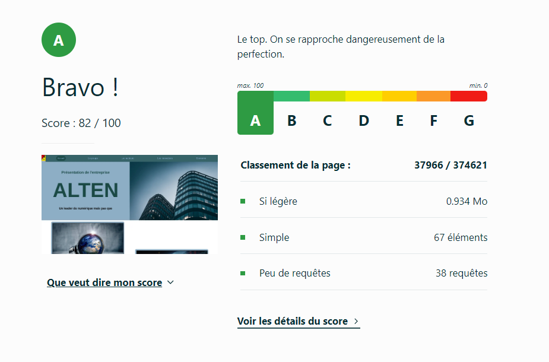
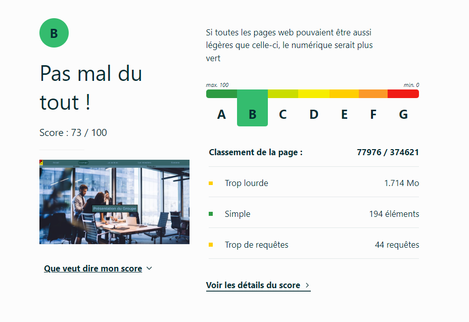
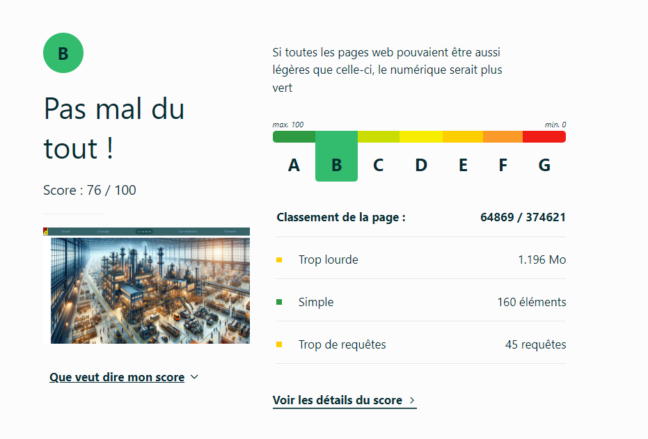
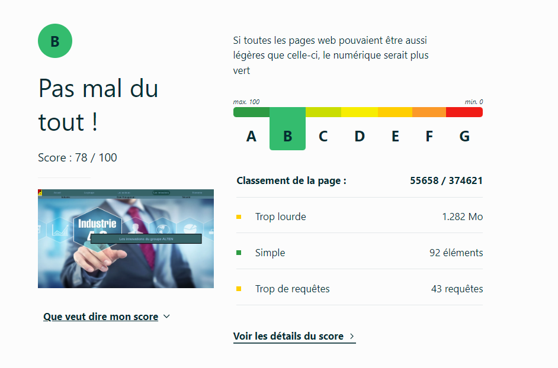
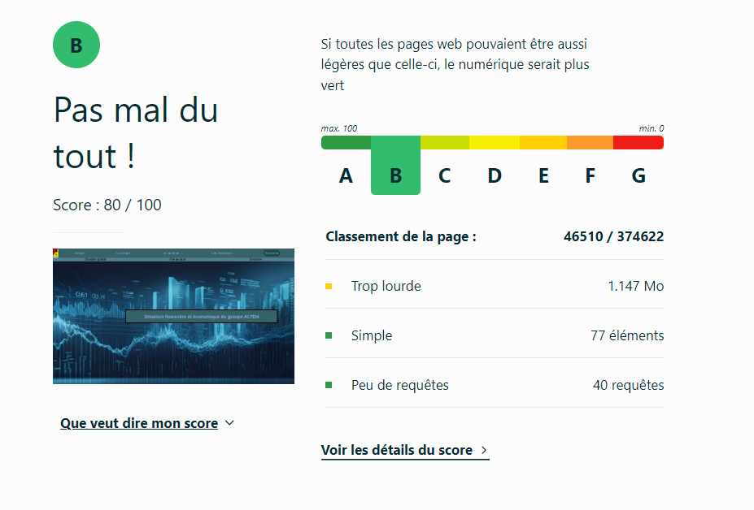
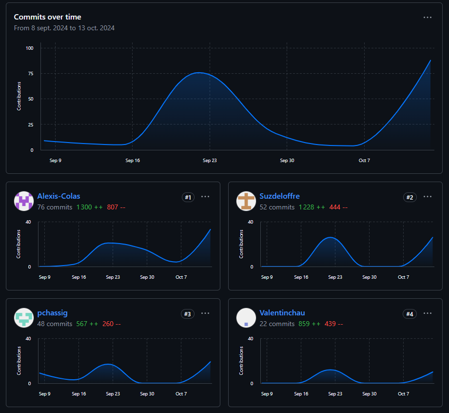

# Presentation-Alten   

## Sujet    

[Alten](https://pchassig.github.io/Presentation-Alten/)

## Membres du groupe :

- [Deloffre Suzanne (référente)](mailto:sdeloffr@edu.univ-fcomte.fr?subject=SAE_1_05_06)  
- [Colas Alexis](mailto:acolas@edu.univ-fcomte.fr?subject=SAE_1_05_06)   
- [Chaudrillier Valentin](mailto:vchaudri@edu.univ-fcomte.fr?subject=SAE_1_05_06)
- [Chassignol Paul](mailto:pchassig@edu.univ-fcomte.fr?subject=SAE_1_05_06)

## Présentation 

Ce dépôt correspond à un site web créé en HTML/CSS/JS dans le cadre de la SAÉ 05-06 à l'IUT de Belfort-Montbéliard. Ce site présente des informations concernant l'entreprise Alten et sert de vitrine pour présenter l'entreprise, ses activité, son organisation et son historique. Vous trouverez dans ce dépôt et sur le site un rapport économique analysant l'aspect économique d'Alten. 
 
## Choix de conception  

Pour la conception du site, nous nous sommes grandement inspirés du site officiel de ALTEN (disponible [ici](https://www.alten.fr)).    

## Développement Site Web et Validation des pages

### Page d'accueil

**Auteurs : Deloffre Suzanne et Chassignol Paul**  

Vérification W3C : [Détail ICI](https://validator.w3.org/nu/?doc=https%3A%2F%2Fpchassig.github.io%2FPresentation-Alten%2Findex.html)

<!--  style="width=400px" ne fonctionne pas -->

### Page du Groupe

**Auteur : Colas Alexis**  

Verification W3C : [Détail ICI](https://validator.w3.org/nu/?doc=https%3A%2F%2Fpchassig.github.io%2FPresentation-Alten%2Fpage_groupe.html)

 

 

### Page des secteurs

**Auteurs : Chaudrillier Valentin**  

Vérification W3C : [Détail ICI](https://validator.w3.org/nu/?doc=https%3A%2F%2Fpchassig.github.io%2FPresentation-Alten%2FSecteurs.html)

<!--  style="width=400px" ne fonctionne pas -->

### Page des innovations

**Auteurs : Chassignol Paul**  

Vérification W3C : [Détail ICI](https://validator.w3.org/nu/?doc=https%3A%2F%2Fpchassig.github.io%2FPresentation-Alten%2Fpage_innovation.html)

<!--  style="width=400px" ne fonctionne pas -->

### Page de l'économie

**Auteurs : Deloffre Suzanne**  

Vérification W3C : [Détail ICI](https://validator.w3.org/nu/?doc=https%3A%2F%2Fpchassig.github.io%2FPresentation-Alten%2Fpage_eco.html)

<!--  style="width=400px" ne fonctionne pas -->

## Répartition du travail

### Planification - Diagramme de GANTT

- Deloffre Suzanne

### Recherches d'informations

- Deloffre Suzanne
- Colas Alexis
- Chaudrillier Valentin
- Chassignol Paul

### Rapport économique

- Deloffre Suzanne
- Colas Alexis
- Chaudrillier Valentin
- Chassignol Paul

### Développement site

- Deloffre Suzanne
  - Page d’accueil
  - "Template" de page (Footer)
  - Page économie
- Colas Alexis
  - Page histoire / groupe
  - "Template" de page (header)
  - Grande majorité du CSS
- Chaudrillier Valentin
  - Page secteurs
- Chassignol Paul
  - Page innovations

## Contributeurs

